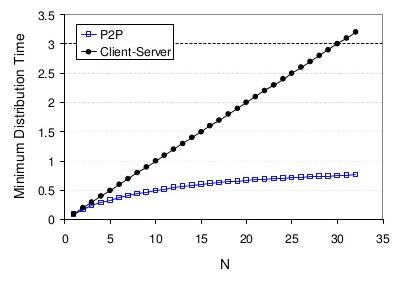
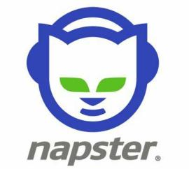

:title: INFRES722 Aplications P2P
:data-transition-duration: 1700
:css: style.css

You can render this presentation to HTML with the command:

    hovercraft index.rst outdir
    
And then view the outdir/index.html file to see how it turned out.

If you are seeing this text, and not reading this as source code, you are
doing it wrong! It's going to be confusing and not very useful.

Use The Source, Luke! But first you probably want to read through the
official documentation at https://hovercraft.readthedocs.org/

----

INFRES722 Aplications P2P
=========================
https://github.com/piotr2b/INFRES722-Aplications-P2P

----

Sommaire
========

* Pourquoi parler des applications pair à pair
* Modèles d'architectures
* Architecture pair à pair
* Plusieurs générations de réseaux
* Quelques applications pair à pair

----

Pourquoi parler des applications pair à pair
============================================

.. note::

	Pour donner aux manifestants de Hong-Kong un logiciel sûr qui leur permettent de traduire leur texte vers toutes les langues.

----

Modèles d'architectures
=======================

Il existe une grande variété d'architecture de réseaux possibles :

* Mainframe : l'égrégore
* Pair à pair : les fourmis
* Deux niveaux : maître et esclave
* Les trois tiers : l'entremetteur
* N niveaux : la spécialisation

.. note:: 

	* Mainframe : terminal passif
	* Pair à pair : on va le décrire.
	* Deux niveaux : un client demande une ressource au serveur qui la fournit à partir de ses propres ressources.
	* Les trois tiers : présentation / métier / base de données.
	* N niveaux : on décompose chaque réponse en plusieurs couches de traitements.

----

Architecture client serveur
---------------------------

Client serveur : modèle de réseau informatique dans lequel un agent, qualifié de client, envoie des requêtes ; l'autre ou les autres, qualifiés de serveurs, attendent les requêtes des clients et y répondent.

.. image:: img/500px-Server-based-network.svg.png
	:width: 300px
	
----

Architecture pair à pair
========================

Pair à pair : modèle de réseau informatique proche du modèle client-serveur mais où chaque client est aussi un serveur.

.. image:: img/500px-P2P-network.svg.png
	:width: 300px

.. note::

    * Client-server:
    	* Client: On/off behavior, Service consumer, Issue requests, Do not communicate directly among them, Need to know the server address.
    	* Server: Always on, Service provider, Receive services, Satisfy requests from many clients, Need a fixed address (or DNS name). Server distributes content to all clients and need to provide the necesarry bandwidth.
    * Peer to peer paradigm:
    	* Runs on end-hosts, On/off behavior, Service providers and consumers, Communicate directly among them, Need to discover other peers, Need to define communication rules, Need to handle peer arrival and departure
    	* Peers can assist a server using their bandwidth. They are equal, merging role of client an server
    	* Those network doesn't necessarily needs a server. Most of time they need for bootstrap but not for resource sharing.

----

Une meilleure mise à l'échelle
------------------------------



1 serveur ou *seeder*, N clients ou *leechers*

.. note::

    * Server distributes content to all clients and need to provide the necesarry bandwidth.
    * Peers are equal, merging role of client an server.

----

Un réseau pair à pair : une surcouche
-------------------------------------

.. image:: img/2000px-Network_Overlay.svg.png
	:width: 600px

Un réseau pair à pair est un graphe (couvrant) dont les arêtes représentent les connexions logiques entre pairs au-dessus de l'infrastructure IP. Sa couverture dépend beaucoup du choix de l'algorithme.

.. note::

	* Tous les liens logiques ne sont pas forcément des liens phyisiques ;
	* Tous les liens physiques ne sont pas forcément utilisés ;
	* C'est un graphe instable car les pairs ne sont pas fixes ;
	* Les voisins d'un nœud n'ont pas forcément ce qu'il demande ou ne veulent pas la partager (incitation au partage) ;

----

Vulnérabilités
--------------

* Empoisonnement : faire passer des fichiers illisibles ou corrompus pour sains et valides ;
* Harcèlement : envoyer n'importe quoi aux autres pairs ;
* Déni de service : infecter les pairs pour qu'ils bloquent les requêtes ;
* Braquage : demander à télécharger toutes les données disponibles sur le réseau sans rien donner en échange ;
* Virus : répendre un logiciel pair à pair lui-même programmé pour espionner l'utilisation de l'utilisateur ;
* Filtrage : un pare-feu bloque les ports utilisés par le réseau ;
* Ingéniérie sociale : découvrir l'identité des utilisateurs puis les harceler, si besoin en les trainant en justice.

----

Plusieurs générations de réseaux
================================

Le jeu du chat et de la souris devant les tribunaux favorise malgré tout l'innovation qui passe principalement par un changement de structure.

* Première génération : un répertoire central est utilisé pour insérer de nouveaux nœuds et centraliser les informations ;
* Deuxième génération : utilisation d'un répertoire réparti donc décentralisé (diffusion de requêtes) ;
* Troisième génération : le répertoire est encore mieux dilué et plus personne ne sait qui sait quoi grace à des algorithmes de hachage distribué. On assiste aussi à la formation de communauté de partage ou au partage incognito.

.. note::

	* 1ère : Napster
	* 2ème : Gnutella (évolué) and Kazaa
	* 3ème :
		* Metanet, WASTE, MUTE
		* GNUnet, Entropy, Freenet

----


.. image:: img/gnutella_large.jpg
	:height: 200px
.. image:: img/Gnutella-Logo-Large.png
	:height: 200px

.. image:: img/logo_mute.gif
	:height: 200px
.. image:: img/500px-GNUnet_logo.svg.png
	:height: 200px
.. image:: img/image.num1285870029.of.world-lolo.com.jpg
	:height: 200px

Mute et d'autres…

----

#. Non structurée : les pairs sont connectés au hasard et inondent le réseau de leur requêtes. Ce réseau est très résistant mais utilise pour lui-même beaucoup de bande passante donc passe mal à l'échelle.
#. Structurée : parmi les pairs en est choisi judicieusement un certain nombre selon certains critères qui seuls ont le droit d'inonder le réseau de requêtes. Les pairs simples se tournent vers eux. Un tel réseau est moins résistant face à la perte d'un nœud principal mais les requêtes sont plus économiques et le réseau passe mieux à l'échelle.
#. Hiérarchique : les pairs s'assemblent de façon à former une structure géométrique, par exemple un hypercube. L'émission de requête est alors intelligente et ciblée mais la pérennité de la géométrie est difficile a assurer.

----


Quelques applications pair à pair
=================================

* apt-p2p, DebTorrent ;
* Réseau anonyme i2p ;
* Skype.

----

apt-p2p, DebTorrent
-------------------

.. image:: img/apt-p2p.png
	:height: 400px

----

Réseau anonyme i2p
------------------

.. image:: img/net.png
	:height: 300px
.. image:: img/endToEndEncryption.png
	:height: 300px

.. note::

	* The network itself is strictly message-based (like IP), but there is a library available to allow reliable streaming communication on top of it (similar to TCP, although from version 0.6 there is a new UDP-based SSU transport). All communication is end-to-end encrypted (in total there are four layers of encryption used when sending a message), and even the end points ("destinations") are cryptographic identifiers (essentially a pair of public keys), so that neither sender nor recipient of a message need to reveal their IP address to the other side or to third-party observers.
	* Although many of the developers had been a part of the Invisible IRC Project (IIP)[8] and Freenet communities, there are significant differences between their designs and concepts. IIP was an anonymous centralized IRC server. Freenet is a censorship-resistant distributed data store. I2P is an anonymous peer-to-peer distributed communication layer designed to run any traditional internet service (e.g. Usenet, email, IRC, file sharing, Web hosting and HTTP, Telnet), as well as more traditional distributed applications (e.g. a distributed data store, a web proxy network using Squid, or DNS).
	* Many developers of I2P are known only under pseudonyms. While the previous main developer, jrandom, is currently on hiatus, others, such as zzz, killyourtv and Complication have continued to lead development efforts, and are assisted by numerous contributors.[9]

----

Skype
-----

.. image:: img/skype.png
	:height: 500px

----

Un logiciel en plein essor
``````````````````````````

.. image:: img/skypegrowth.jpg
	:width: 500px

.. image:: img/news20130213-1.gif
	:width: 500px

.. note::

	* Architecture pair à pair
	* Données de service : voix, vidéo, partage de bureau…
	* Données de signalisation : identification, rechercher des amis…
	* Logiciel privateur

----

?
